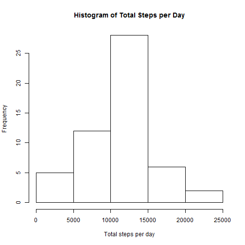
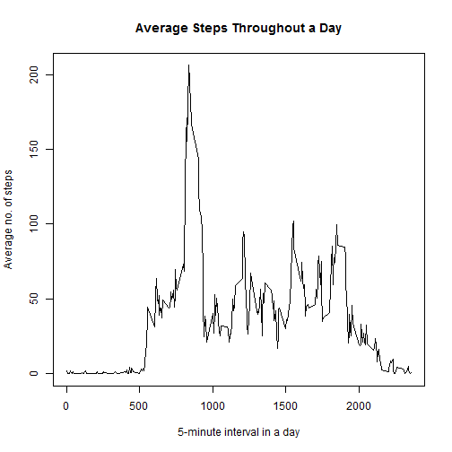
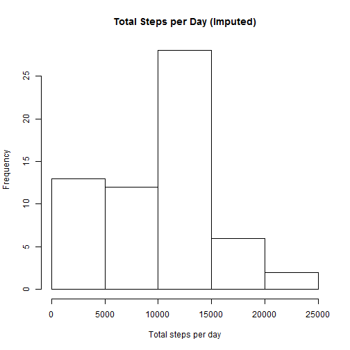
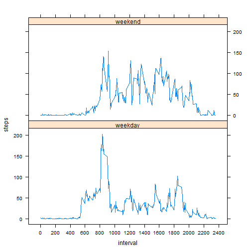

####Loading and preprocessing data


####What is the mean total number of steps taken per day?

```r
total <- aggregate(steps ~ date, act, sum)
hist(total$steps, xlab="Total steps per day", main="Histogram of Total Steps per Day")
```

 

```r
summary(total$steps)[3:4]
```

```
## Median   Mean 
##  10760  10770
```

####What is the average daily activity pattern?

```r
average <- aggregate(steps ~ interval, act, mean, na.rm=TRUE)
plot(average$interval, average$steps, type="l", ylab="Average no. of steps", xlab="5-minute interval in a day", main="Average Steps Throughout a Day")
```

 

```r
average$interval[which.max(average$steps)]
```

```
## [1] 835
```

####Imputing missing values

```r
nrow(act) - sum(complete.cases(act))
```

```
## [1] 2304
```

```r
act2 <- spread(act, interval, steps, drop=FALSE)
for (i in 2:ncol(act2)) {
  act2[,i] <- replace(act2[,i], which(is.na(act2[,i])), mean(act2[,2], na.rm=TRUE))
}
imputed <- gather(act2, interval, steps, -date)
imputed_total <- aggregate(steps ~ date, imputed, sum)
hist(imputed_total$steps, xlab="Total steps per day", main="Total Steps per Day (Imputed)")
```

 

```r
summary(imputed_total$steps)[3:4]
```

```
## Median   Mean 
##  10400   9419
```

####Are there differences in activity patterns between weekdays and weekends?

```r
imputed$days <- weekdays(as.Date(imputed$date))
imputed$days <- gsub("^Sat.*|^Sun.*", "weekend", imputed$days)
imputed$days <- gsub("^Mon.*|^Tue.*|^Wed.*|^Thu.*|^Fri.*", "weekday", imputed$days)
imputed$days <- as.factor(imputed$days)
imputed_agg <- aggregate(steps ~ days+interval, imputed, mean, na.rm=TRUE)
imputed_agg$interval <- as.numeric(as.character(imputed_agg$interval))
xyplot(steps ~ interval | days, data=imputed_agg, layout=c(1,2), type="l", scales = list(x=list(tick.number=15)))
```

 
